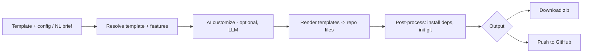

# Project Bootstrapper — ARCHITECTURE

Simple, mostly-deterministic generation tool (a workflow, not a complex system).

## Components
| Component | Job | Tech |
|-----------|-----|------|
| CLI | Primary entry (`bootstrap`) | Node CLI (commander) |
| Web app | Wizard UI | Next.js |
| API | Config → generation | NestJS |
| Template engine | Render template repos with config | Handlebars/EJS + file ops |
| AI customizer (V1) | NL brief → config + small code edits | `packages/llm` |
| GitHub integration | Create + push repo | GitHub API |

## Boundaries
Generation is a deterministic workflow; the only AI step is optional NL customization. No heavy backend; templates are versioned repos. Stateless per generation (config in, repo out).

## Multi-tenancy
Light — `org_id` for saved templates/configs (V1+); RLS (D-004). Most usage is stateless CLI.

## Scale
Trivial (generation is cheap, infrequent per user). Managed PaaS; no K8s needed. (D-009.)

## NFRs
Generate < 15s; output compiles + passes its generated tests; agent files valid; secrets never committed.
