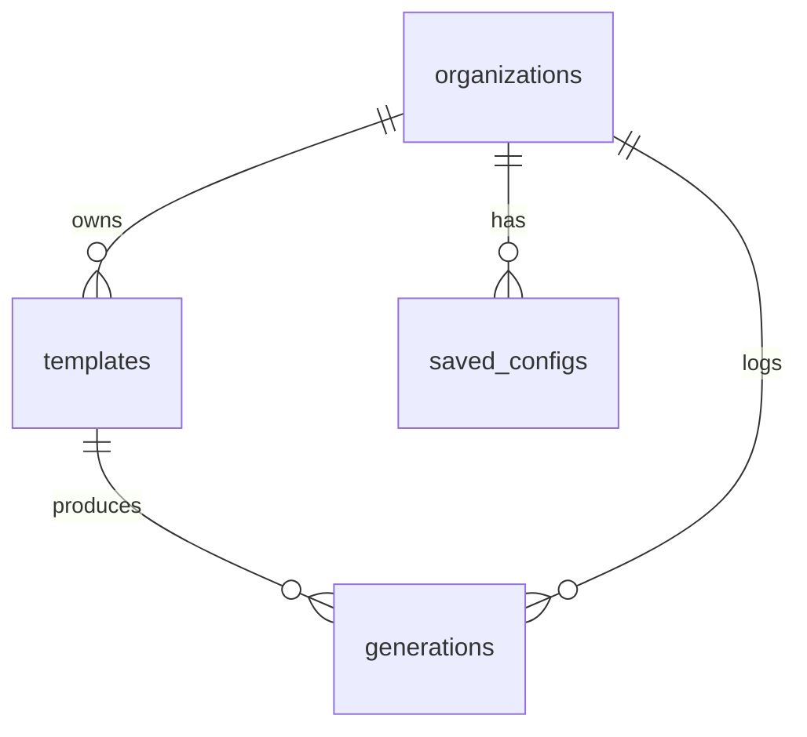

# Project Bootstrapper — DATABASE

Light schema (mostly stateless CLI). PostgreSQL, `org_id`+RLS (D-004).

## Entities
`users`, `organizations`, `memberships`, `templates` (built-in + org custom: name, source repo, version, config schema), `generations` (template_id, config, output ref, status — for history/analytics), `saved_configs` (reusable presets), `audit_logs`, `subscriptions`, `api_keys`.

## ERD

## Notes
- `templates` reference versioned template repos (in git/object storage), not blobs in DB.
- `generations` logged for analytics + history (config + output ref); generated code lives in user's GitHub/zip, not our DB.
- `org_id` + RLS for custom templates/configs (V1+). Most generation is stateless.
- No vectors needed (no RAG); pgvector optional only for template search (V2).
- Backups standard; minimal sensitive data (no customer code stored).
