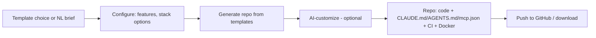

# AI Project Bootstrapper

[](./LICENSE)
[](#-free--open-source)
[](https://github.com/sponsors/MNikks01)

> 💚 **Free & open source, forever.** Every feature is available to everyone — no paywalls, no tiers, no sign-up. Clone and self-host it, or use the hosted app. Licensed under Apache-2.0. If it helps you, [sponsoring](https://github.com/sponsors/MNikks01) is welcome but always optional.

**▶ Try it / deploy your own:** [](https://vercel.com/new/clone?repository-url=https%3A%2F%2Fgithub.com%2FMNikks01%2Fproject-bootstrapper&root-directory=web&project-name=project-bootstrapper) · see [DEPLOY.md](./DEPLOY.md) for CLI & self-hosting.

**🖥️ CLI:** scaffold a **complete, runnable** project and install it for you — published on npm (needs Node ≥18):
```bash
npm i -g @mnikks01/bootstrap    # installs the `bootstrap` command — or use npx (no install) below
npx @mnikks01/bootstrap my-api --template express-api          # then: cd my-api && npm run dev
npx @mnikks01/bootstrap my-app --template next-app --features auth,docker,ci
npx @mnikks01/bootstrap my-spa --template react-vite
npx @mnikks01/bootstrap --help
```
Templates (each is a complete, working codebase): **next-app**, **express-api**, **fastify-api**, **react-vite**, **node-cli**, **mcp-server** (`ai-saas`/`node-service` kept as aliases). The CLI writes the files, runs `git init`, and runs `npm install` automatically (use `--no-install` / `--no-git` to skip). Optional `--features auth,billing,rag,mcp,docker,ci` add coherent extras.

From a clone instead: `node engine/src/cli.ts <args>`.


> **Spin up production-grade, AI-ready repositories in minutes.** Opinionated scaffolds with auth, billing, CI, observability, guardrails, and agent-context files (`CLAUDE.md`/`AGENTS.md`/`mcp.json`) pre-wired.

**Project #5** · Priority ⭐ · Difficulty: Low-Medium · Time-to-MVP: 3–4 weeks · **Best as a ContextOS feature, not a standalone company.**

## About this repository

This is **Project Bootstrapper (#5)**, extracted from a larger "AI Startup Lab." The root docs are the product spec/vision; references to sibling projects point to that broader context and aren't part of this standalone repo. Related repos: [`contextos`](https://github.com/MNikks01/contextos) (#1), [`codebase-intelligence`](https://github.com/MNikks01/codebase-intelligence) (#2), [`mcp-server-generator`](https://github.com/MNikks01/mcp-server-generator) (#3), [`agent-monitoring-platform`](https://github.com/MNikks01/agent-monitoring-platform) (#4).

**The working engine + CLI is in [`engine/`](./engine)** — turn a spec (template + feature toggles: auth/billing/rag/mcp/docker/ci) into a complete, AI-agent-ready project (code + `CLAUDE.md`/`AGENTS.md`/`mcp.json` + CI + Docker). Pure TypeScript, zero-network. Try it:
```bash
cd engine && node scripts/demo.ts && node scripts/test.ts
node src/cli.ts "My App" --template ai-saas --features auth,mcp,ci -o ./my-app
```

Licensed under **Apache-2.0** — see [LICENSE](./LICENSE).

## What
A generator (CLI + web) that produces complete, production-ready project scaffolds — not just `create-next-app`, but the full opinionated stack this lab uses (Next.js + NestJS + Postgres+pgvector + Stripe + OTel + evals + Docker + GitHub Actions), **AI-agent-ready out of the box** (agent-context files, MCP config, guardrails). Optionally AI-customized from a natural-language brief.

## Why
Starting a production AI app means days of boilerplate every time. Existing scaffolders (`create-*`, v0, bolt) are either too basic or non-production. The lab itself needs consistent scaffolds across 7 products → build the tool, then offer it. **Honest take:** weak standalone monetization (scaffolding is commoditized/free); its real value is internal reuse + a ContextOS feature + a funnel/brand asset.

## Who
Developers/teams/agencies starting many projects who want production-grade, AI-ready, standardized starts. See [CUSTOMERS.md](./CUSTOMERS.md).

## How


## Capability ladder
- **MVP:** CLI + curated templates (AI SaaS starter), agent-context files, CI/Docker, GitHub push.
- **V1:** Web UI, feature toggles (auth/billing/RAG/MCP), NL-brief AI customization, teams.
- **V2:** Custom org templates, golden-path enforcement, ContextOS integration.
- **V3:** Enterprise standards/governance, private template registry.

## Doc map
[VISION](./VISION.md) · [PROBLEM](./PROBLEM.md) · [CUSTOMERS](./CUSTOMERS.md) · [FEATURES](./FEATURES.md) · [USER_STORIES](./USER_STORIES.md) · [ARCHITECTURE](./ARCHITECTURE.md) · [TECH_STACK](./TECH_STACK.md) · [DATABASE](./DATABASE.md) · [API_DESIGN](./API_DESIGN.md) · [AI_ARCHITECTURE](./AI_ARCHITECTURE.md) · [RAG](./RAG.md) · [MCP](./MCP.md) · [AGENT_DESIGN](./AGENT_DESIGN.md) · [SECURITY](./SECURITY.md) · [OBSERVABILITY](./OBSERVABILITY.md) · [GUARDRAILS](./GUARDRAILS.md) · [DEVOPS](./DEVOPS.md) · [TASKS](./TASKS.md) · [SPRINTS](./SPRINTS.md) · [PRICING](./PRICING.md) · [GTM](./GTM.md) · [SALES](./SALES.md) · [RISKS](./RISKS.md) · [HIRING](./HIRING.md) · [OPEN_SOURCE](./OPEN_SOURCE.md) · [RESUME_VALUE](./RESUME_VALUE.md) · [CLAUDE.md](./CLAUDE.md) · [AGENTS.md](./AGENTS.md) · [llms.txt](./llms.txt) · [mcp.json](./mcp.json)

*Build opportunistically (it falls out of building the lab's own repos). Likely a ContextOS module, not a separate company.*
